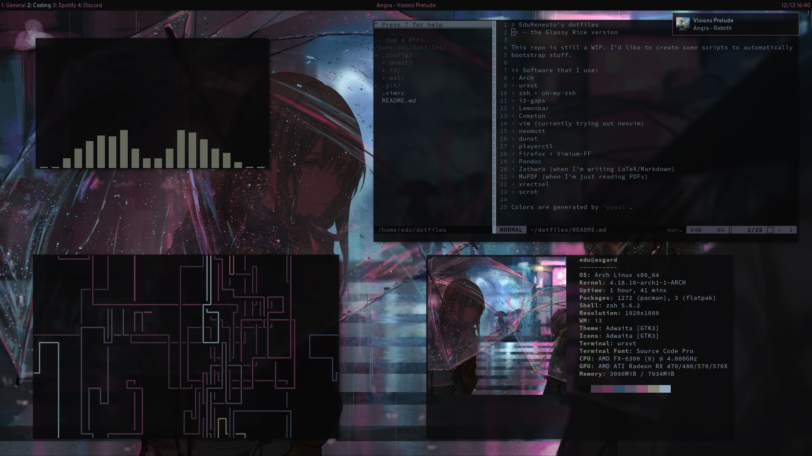

# EduRenesto's dotfiles
## - the Glassy Rice version

This repo is still a WIP. I'd like to create some scripts to automatically
bootstrap stuff.

## Software that I use:
* Arch 
* urxvt
* zsh + oh-my-zsh
* i3-gaps
* Lemonbar
* Compton
* vim (currently trying out neovim)
* neomutt
* dunst
* playerctl
* Firefox + Vimium-FF
* Pandoc
* Zathura (when I'm writing LaTeX/Markdown)
* MuPDF (when I'm just reading PDFs)
* xrectsel 
* scrot

Colors are generated by `pywal`.
